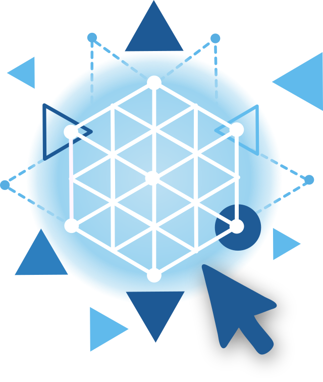

# Blender add-on development for beginners

This is the repository that accompanies [the YouTube video series](https://youtube.com/playlist?list=PLxyAbGpHucHZs5InOs_9-apX7wBIQtrrJ&si=kmYMtRvAGMqP9qw0) on writing add-ons for Blender.

It contains [the source code](/add-ons/) for the add-ons that were shown in the videos, as well as for someof the [snippets](/snippets/)
that are shown in some of the videos.

Add-ons that require multiple files and need to be distributed as a .zip file are each in their own folder. Currently that is just one addon, [render_done](./render_done/), which is a refactored version from the [single file version](add-ons/render_done.py). For instructions on how to create a .zip file you can distribute, see [Installing the add-ons](#installing-the-add-ons)

**Table of contents**
- [Videos](#videos)
  - [Introduction video \[Released: **14 january 2026**\]](#introduction-video-released-14-january-2026)
  - [Module: Getting started \[Released: **14 january 2026**\]](#module-getting-started-released-14-january-2026)
  - [Module: Adding mesh objects \[Released: **21 \& 28 january 2026**\]](#module-adding-mesh-objects-released-21--28-january-2026)
  - [Module: Skinning an armature \[Released: **4 february 2026**\]](#module-skinning-an-armature-released-4-february-2026)
  - [Module: Rigging a curve \[Release date: **11 february 2026**\]](#module-rigging-a-curve-release-date-11-february-2026)
  - [Module: Overlays and preferences \[Release date: **18 february 2026**\]](#module-overlays-and-preferences-release-date-18-february-2026)
  - [Module: App handlers and presets \[Release date: **25 february 2026**\]](#module-app-handlers-and-presets-release-date-25-february-2026)
  - [Module: Multi file add-ons \[Release date: **4 march 2026**\]](#module-multi-file-add-ons-release-date-4-march-2026)
- [Installing the add-ons](#installing-the-add-ons)
  - [Multi file add-ons](#multi-file-add-ons)
- [Notes and issues](#notes-and-issues)
- [License](#license)
- [Contributions and suggestions](#contributions-and-suggestions)

## Videos

In order of appearance (click to follow the link to the relevant video, some add-ons are discussed in multiple videos and some videos present more than one bit of code/snippet):

### Introduction video [Released: **14 january 2026**]

[**Video: Blender add-on development**](https://youtu.be/brcuzWr8l_Q)

### Module: Getting started [Released: **14 january 2026**]

#### add-ons

(click to go to relevant video)

- [move_x.py](https://youtu.be/u65VncJHO4A) [**Video: How to move a cube**](https://youtu.be/u65VncJHO4A)
- [move_x_menu.py](https://youtu.be/GoOwF0faSsM) [**Video: Getting started**](https://youtu.be/GoOwF0faSsM)
- [move_x_poll.py](https://youtu.be/wyq9lSA9BgQ) [**Video: Your first add-on**](https://youtu.be/wyq9lSA9BgQ)
- [move_x_property.py](https://youtu.be/wyq9lSA9BgQ) [**Video: Your first add-on**](https://youtu.be/wyq9lSA9BgQ)
- [About IDEs, no code](https://youtu.be/CshKJ-Pk788) [**Video: external editors**](https://youtu.be/CshKJ-Pk788)

### Module: Adding mesh objects [Released: **21 & 28 january 2026**]

#### add-ons 

(click to go to relevant video)

- [add_star_basic.py](https://youtu.be/3ufMK24tiXU) [**Video: Adding mesh objects**](https://youtu.be/3ufMK24tiXU)
- [add_star.py](https://youtu.be/kD-K-ljJQf4) [**Video: A mesh from scratch**](https://youtu.be/kD-K-ljJQf4)
- [add_star_with_operators.py](https://youtu.be/vR3-q5BYlRQ) [**Video: A mesh from operators**](https://youtu.be/vR3-q5BYlRQ)
- [add_star_with_modifiers.py](https://youtu.be/DJj4ycpRD9w) [**Video: Adding a modifier**](https://youtu.be/DJj4ycpRD9w)

### Module: Skinning an armature [Released: **4 february 2026**]

#### add-ons / snippet 

(click to go to relevant video)

- [Intro, no code](https://youtu.be/xvwydYy7bII) [**Video: Skinning an armature - Intro**](https://youtu.be/xvwydYy7bII)
- [skin_armature.py](https://youtu.be/hKaWaIYJdMI) [**Video: Skinning an armature - Geometry**](https://youtu.be/hKaWaIYJdMI)
- [skin_armature.py](https://youtu.be/rk5aFsNqCik) [**Video: Skinning an armature - Modifiers**](https://youtu.be/rk5aFsNqCik)
- [change_vertex_radii.py](https://youtu.be/bZWgEG-Xb5k) [**Video: Skinning an armature - Tips**](https://youtu.be/bZWgEG-Xb5k)

### Module: Rigging a curve [Release date: **11 february 2026**]

#### add-ons 

(click to go to relevant video)

- [Intro, no code](https://youtu.be/uWCpqOgYIdM) [**Video: Rigging a curve - Intro**](https://youtu.be/uWCpqOgYIdM)
- [rig_curve.py](https://youtu.be/m4s-m9pTUfw) [**Video: Rigging a curve - Code**](https://youtu.be/m4s-m9pTUfw)

### Module: Overlays and preferences [Release date: **18 february 2026**]

#### add-ons / snippet 

(click to go to relevant video)

- [overlay_cube.py](https://youtu.be/f10SyYoorV8) [**Video: Overlays and preferences - Overlays**](https://youtu.be/f10SyYoorV8)
- [overlay_text.py](https://youtu.be/f10SyYoorV8) [**Video: Overlays and preferences - Overlays**](https://youtu.be/f10SyYoorV8)
- [distance_overlay.py](https://youtu.be/F8DhKTWXl8w) [**Video: Overlays and preferences - The overlay add-on**](https://youtu.be/F8DhKTWXl8w)
- [user preferences in distance_overlay.py](https://youtu.be/F8DhKTWXl8w) [**Video: Overlays and preferences - User preferences**](https://youtu.be/F8DhKTWXl8w)
- [tip to improve distance_overlay.py](https://youtu.be/EUpGNfuUtH8) [**Video: Overlays and preferences - Tips**](https://youtu.be/EUpGNfuUtH8)
  
### Module: App handlers and presets [Release date: **25 february 2026**]

#### add-ons / snippet 

(click to go to relevant video)

- [app_handers.py](https://youtu.be/x9DFL2Xm6Vc) [**Video: App handlers and presets - App handlers**](https://youtu.be/x9DFL2Xm6Vc)
- [mail_something_plain_password.py](https://youtu.be/5eD5jsjXvDw) [**Video: App handlers and presets - Preferences**](https://youtu.be/5eD5jsjXvDw)
- [mail_something.py](https://youtu.be/A6dPKQCmwrw) [**Video: App handlers and presets - Sending email**](https://youtu.be/A6dPKQCmwrw)
- [render_done.py](https://youtu.be/vVLlCtpJcbw) [**Video: App handlers and presets - Completing the add-on**](https://youtu.be/vVLlCtpJcbw)
- [render_done.py](https://youtu.be/P7DRHRADCCE) [**Video: App handlers and presets - Presets**](https://youtu.be/P7DRHRADCCE)

### Module: Multi file add-ons [Release date: **4 march 2026**]

(click to go to relevant video)

- [render_done/](https://youtu.be/uEHAJVvp13w) [**Video: A multi-file package**](https://youtu.be/uEHAJVvp13w)
- [render_done/](https://youtu.be/jqyxPnwICzI) [**Video: Custom icons**](https://youtu.be/jqyxPnwICzI)


## Installing the add-ons

In each module we create several versions of the same addon, each time with the same name,
so before installing a new version make sure to check if there already is a version installed
in *Preferences > Add-ons*, and if so, uninstall it.

Then install the add-on by going to Preferences > Add-ons > Install from disk (at the top right corner),
and then locate the add-on to install.

If you are unfamiliar with GitHub, you can either click on the green `Code` button and select `Download Zip` to get all code as one zip file, or you can go to one of the individual files in the [add-ons](/add-ons/) directory and
download one of them by clicking on it and then selecting `Download raw file` (upper right).

If you are familiar with GitHub and git, you can of course choose to clone the repository instead.

### Multi file add-ons

Some add-ons, for example the refactored version of [render_done](./render_done/) contain multiple files. Such a *package* needs to be distributed as a .zip file.

You can create such a zip file from the command line with:

```bash
zip -r render_done.zip render_done
```

In Windows (or a graphical file browser on your OS of choice, like Dolphin) you can also go to the folder in the file explorer and select all files and any subfolders and then right-click -> Add to compressed archive (or similar). Make sure *not* to include the top level folder itself. The .zip file can then be installed like any other add-on.


> [!NOTE]  
> The repository only contains the final version shown in the videos, but often enhanced with extra comments.

> [!NOTE]
> If you use an IDE like Visual Studio Code, you might want to create a virtual environment and install the [fake-bpy-module](https://pypi.org/project/fake-bpy-module/) from pypi. We discuss that briefly in the [**Video: external editors**](https://youtu.be/CshKJ-Pk788)

## Notes and issues

When an operator has been registered it will probably not appear right away at the top of the search menu (F3). You might have to type in the name of the operator first. Once used it will appear at the top, and that is why you see it there in the video, because the recording required several trial runs.

## License

All *source code* and *documentation* in this repository is released under a [GPL license](/LICENSE).

The logo is (c) 2025, 2026 varkenvarken, All rights reserved.

## Contributions and suggestions

If you have a suggestion for a topic you´d like to see in the series, create an [issue in this repo](https://github.com/varkenvarken/Blender-add-on-development/issues), or add a comment to one of the videos in [the series](https://youtube.com/playlist?list=PLxyAbGpHucHZs5InOs_9-apX7wBIQtrrJ&si=gWrpdnJ7424x7DqL).

<a href="https://ko-fi.com/varkenvarken">Consider leaving me a tip on Ko-Fi (if you can afford it)</a>
