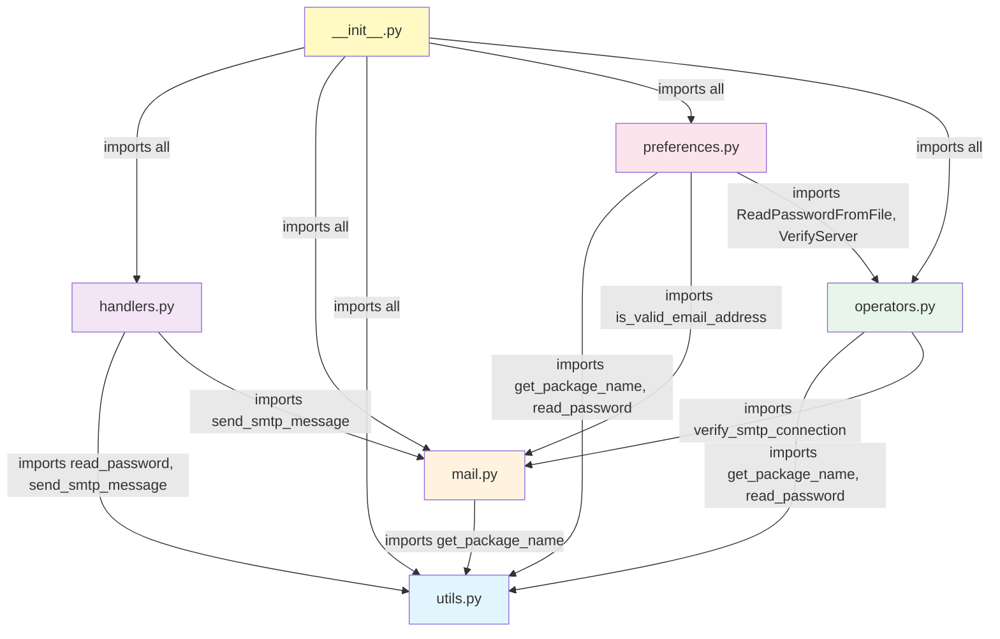

# render_done Package

When creating a rather complicated import graph it is import to check if there are no cyclic dependencies. In this case there are none, see the graph below.

Note: The graph was created by Github copilot but verified by me. The prompt was:

    create a mermaid diagram that shows the import dependancies,
    but only for the modules defined in the render_done package

## Import Dependencies

## Module Overview

- **utils.py** - Utility functions with no internal dependencies (get_package_name, read_password)
- **mail.py** - Email handling and SMTP operations (depends on utils)
- **handlers.py** - Render event handlers (depends on utils and mail)
- **operators.py** - Blender operators (depends on utils and mail)
- **preferences.py** - Addon preferences UI (depends on utils, mail, and operators)
- **__init__.py** - Main module initialization (imports and registers all others)
